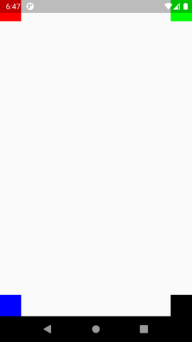
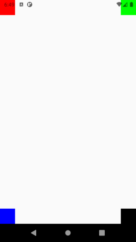

# AbstractBaseFragment, BaseFragment 클래스

기본 프래그먼트

## 1. AbstractBaseFragment

### 1.1. 설명

기본적인 기능이 포함된 프래그먼트

### 1.2. 사용방법

기존 `Fragment`을 상속하여 사용하던걸 `AbstractBaseFragment`으로 변경하여 사용

```java
public class TestFragment extends AbstractBaseFragment {
}
```

## 2. BaseFragment

### 2.1. 설명

`AbstractBaseFragment`에서 데이터바인딩이 적용된 기본 프래그먼트

### 2.2. 사용방법

데이터바인딩 객체를 지정하여 `BaseFragment`을 상속합니다.  
`onCreateView'를 구현할 필요없이 컨텐츠가 데이터바인딩 객체를 통하여 내부적으로 적용됩니다.

```java
public class TestFragment extends BaseFragment<FragmentTestBinding> {
    // getBinding() 메소드로 바인딩 객체를 쓸 수 있습니다.
}
```

## 3. 기능

### 3.1. 뒤로가기 버튼 제어

#### 3.1.1. 설명

뒤로가기 버튼 이벤트를 받아 제어할 수 있도록 함.

#### 3.1.2. 사용방법

onBackPressed 메소드를 오버라이딩하여 super를 통해 메소드를 호출하는것으로 제어할 수 있습니다.

```java
@Override
public void onBackPressed() {
    // 주석처리하거나 지워버리면 뒤로가기를 막을 수 있음.
    super.onBackPressed();
}
```

### 3.2. 로케일 관리

#### 3.2.1. 설명

앱 전반적인 로케일을 설정할 수 있습니다.

#### 3.2.2. 메소드 설명

- 현재 설정되어 있는 로케일 반환.  
  앱 상에서 로케일을 바꾸지 않았으면 시스템에서 설정되어있는 로케일을 반환함.

```java
getLocale();
```

- 로케일 지정

```java
applyLocale(Locale.KOREAN);
```

- 앱에서 지원되는 로케일 목록 지정

```java
registerSupportedLocales(Arrays.asList(
    Locale.KOREAN,
    Locale.ENGLISH
));
```

### 3.3. 화면 스타일 변경

#### 3.3.1. 전체화면 지정

- 코드

```java
applyFullscreenTheme();
```

- 미리보기  


#### 3.3.2. 반투명 상태바 지정

- 코드

```java
applyTranslucentTheme();
```

- 미리보기  


#### 3.3.3. 투명 상태바 지정

- 코드

```java
applyTransparentTheme();
```

- 미리보기  


#### 3.3.4. 상태바 아이콘 색상 지정

- 코드

```java
applyLightStatusBar(true /* 상태바 밝은색 유무 */);
```

- 미리보기(순서대로 true, false)  



### 3.4. 앱 테마 지정

- 현재 테마 타입 반환

```java
int type = getApplicationTheme();
```

- 테마 변경

```java
applyApplicationTheme(ThemeType.DARK /* ThemeType 참고 */);
```

- [테마 타입](../../library/src/main/java/com/nextstory/app/theme/ThemeType.java)

```java
// 밝은 테마
ThemeType.LIGHT;

// 어두운 테마
ThemeType.DARK;

// 시스템 설정에 따름
ThemeType.SYSTEM;
```
