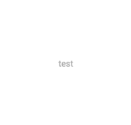
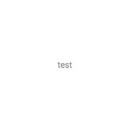
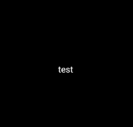

# 리소스

라이브러리 이용 시 사용할 수 있는 리소스입니다.

## 기본 화면전환

프래그먼트, 액티비티에서 화면 전환간 사용되는 애니메이션 리소스

- [anim_default_navigator_enter](../../library/src/main/res/anim/anim_default_navigator_enter.xml)
- [anim_default_navigator_exit](../../library/src/main/res/anim/anim_default_navigator_exit.xml)
- [anim_default_navigator_pop_enter](../../library/src/main/res/anim/anim_default_navigator_pop_enter.xml)
- [anim_default_navigator_pop_exit](../../library/src/main/res/anim/anim_default_navigator_pop_exit.xml)
- [anim_default_navigator_replace_enter](../../library/src/main/res/anim/anim_default_navigator_replace_enter.xml)
- [anim_default_navigator_replace_exit](../../library/src/main/res/anim/anim_default_navigator_replace_exit.xml)

## 셀렉터 드로어블

버튼 대신에 특정 텍스트나 레이아웃에 버튼처럼 포커스 효과를 주고 싶을때 사용.

### 사용시 참고사항

해당 리소스를 배경에 적용하기 위해서는 아래 속성을 사용해야합니다.

```xml
<!-- 
    아래의 뷰 속성이 필수로 설정되어 있어야합니다.
    android:clickable="true"
    android:focusable="true"
-->
<View
    android:layout_width="match_parent"
    android:layout_height="match_parent"
    android:background="@drawable/bg_selector_dark"
    android:clickable="true"
    android:focusable="true" />
```

### 어두운색

- [bg_selector_black](../../library/src/main/res/drawable/bg_selector_black.xml) : 물결 효과
- [bg_selector_black_holo](../../library/src/main/res/drawable/bg_selector_black_holo.xml) : holo 효과
- [bg_selector_dark](../../library/src/main/res/drawable/bg_selector_dark.xml) : 물결 효과, 다크모드일 경우 밝은색 표시
- [bg_selector_dark_holo](../../library/src/main/res/drawable/bg_selector_dark_holo.xml) : holo 효과, 다크모드일 경우 밝은색 표시

### 밝은색

- [bg_selector_white](../../library/src/main/res/drawable/bg_selector_white.xml) : 물결 효과
- [bg_selector_white_holo](../../library/src/main/res/drawable/bg_selector_white_holo.xml) : holo 효과
- [bg_selector_light](../../library/src/main/res/drawable/bg_selector_light.xml) : 물결 효과, 다크모드일 경우 어두운색 표시
- [bg_selector_light_holo](../../library/src/main/res/drawable/bg_selector_light_holo.xml) : holo 효과, 다크모드일 경우 어두운색 표시

### 효과 미리보기

#### 물결




#### holo




## 색상

### 일반 색상

- transparent : 투명색
- black : 검정
- white : 하얀색
- black_{투명도} : 검정 (투명도는 10% 단위)
- white_{투명도} : 하얀색 (투명도는 10% 단위)

### 다크모드 지원 색상

- dark : 검정, 다크모드일 경우에는 하얀색
- light : 하얀색, 다크모드일 경우에는 검정색
- dark_{투명도} : 검정, 다크모드일 경우에는 하얀색 (투명도는 10% 단위)
- light_{투명도} : 하얀색, 다크모드일 경우에는 검정색 (투명도는 10% 단위)
