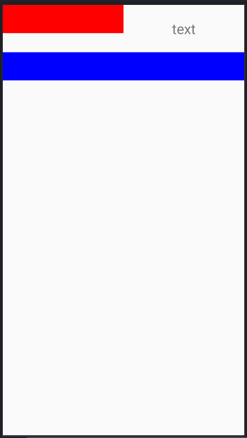
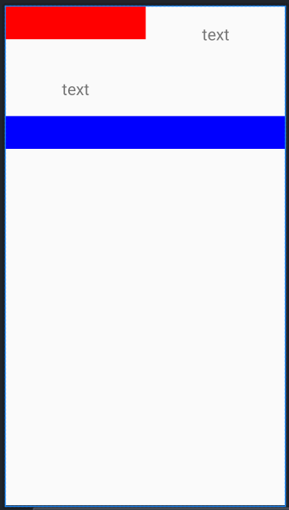
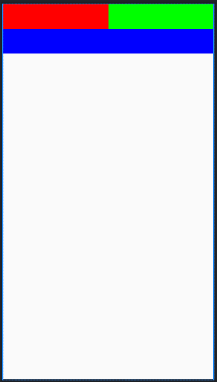

# DataBindingGridLayout

`RecyclerView`를 확장한 레이아웃.  
기존 `RecyclerView`을 사용했을때 어댑터를 코드상으로 지정하지 않고 간단히 xml로 구성하기위해 사용.

## 1. 목록

- DataBindingGridLayout : 레이아웃
- DataBindingGridLayoutItem : 레이아웃 데이터바인딩 항목

## 2. 설명

### 2.1. DataBindingGridLayout

#### 2.1.1. 속성

- spanCount : 그리드의 열 또는 행 사이즈
- reverseLayout : 요소를 표시하는 위치를 반대로 설정
- orientation : 요소를 표시하는 방향, `vertical` 또는 `horizontal`로 지정, `vertical`이 기본값

#### 2.1.2. 바인딩어댑터

- onBottomScrollReached : `orientation="vertical"`일 때 스크롤이 가장 하단에 도달할 경우 트리거되는 메서드를 지정함.

```xml
<com.nextstory.widget.DataBindingGridLayout
    android:layout_width="match_parent"
    android:layout_height="match_parent"
    android:orientation="vertical"
    app:spanCount="2"
    app:onBottomScrollReached="@{() -> 여기에 실행할 코드를 입력}">
</com.nextstory.widget.DataBindingGridLayout>
```

### 2.2. DataBindingGridLayoutItem

#### 2.2.1. 속성

- itemBindingName : 모델 바인딩 이름, 기본값은 `item`
- positionBindingName : 위치값 바인딩 이름, 기본값은 `position`
- callbackBindingName : 콜백 객체 바인딩 이름, 기본값은 `callback`
- layout : 레이아웃 리소스

#### 2.2.2. 바인딩어댑터

- items : 모델 바인딩

```xml
<!-- app:items로 실제 데이터와 연결되는 필드를 바인딩함. -->
<com.nextstory.widget.DataBindingGridLayoutItem
    android:layout_width="match_parent"
    android:layout_height="wrap_content"
    app:items="@{fragment.someModels}"
    app:layout="@layout/adapter_test" />
```

- onItemCallback : 콜백 트리거 메서드

```xml
<!--
    app:layout에 지정한 레이아웃에 설정된 콜백을 받는 부분을
    app:onItemCallback로 지정함.

    (v, o, i) 각 인자 설명
    v : 콜백 전달 시 참조되는 뷰
    o : 항목 데이터 모델
    i : 선택한 데이터 위치
-->
<com.nextstory.widget.DataBindingGridLayoutItem
    android:layout_width="match_parent"
    android:layout_height="wrap_content"
    app:itemBindingName="string"
    app:items="@{fragment.someModels}"
    app:layout="@layout/adapter_test"
    app:onItemCallback="@{(v, o, i) -> 여기에 실행할 코드 입력}" />

<!--
    adapter_test.xml
    (app:layout에 지정한 레이아웃 코드)
    아래 부분에 onClick 이벤트 설정된 부분에 callback.onItemCallback으로 콜백을 전달함.
-->
<?xml version="1.0" encoding="utf-8"?>
<layout xmlns:android="http://schemas.android.com/apk/res/android"
    xmlns:tools="http://schemas.android.com/tools">

    <data>
        <variable
            name="string"
            type="String" />
        <variable
            name="position"
            type="Integer" />
        <variable
            name="callback"
            type="com.nextstory.widget.DataBindingItemCallback" />
    </data>

    <TextView
        android:layout_width="match_parent"
        android:layout_height="wrap_content"
        android:gravity="center"
        android:padding="24dp"
        android:text="@{string}"
        android:textSize="24sp"
        android:onClick="@{v -> callback.onItemCallback(v, string, position)}"
        tools:text="text" />

</layout>
```

## 3. 예제

### 3.1. 데이터바인딩 사용

데이터 목록 모델에 따라 표시될 항목을 레이아웃을 직접 설정합니다.

- 코드 (항목)

```xml
<?xml version="1.0" encoding="utf-8"?>
<layout xmlns:android="http://schemas.android.com/apk/res/android"
    xmlns:tools="http://schemas.android.com/tools">

    <data>
        <variable
            name="string"
            type="String" />
    </data>

    <TextView
        android:layout_width="match_parent"
        android:layout_height="wrap_content"
        android:gravity="center"
        android:padding="24dp"
        android:text="@{string}"
        android:textSize="24sp"
        tools:text="text" />

</layout>
```

- 코드 (메인)

```xml
<com.nextstory.widget.DataBindingGridLayout
    android:layout_width="match_parent"
    android:layout_height="match_parent"
    android:orientation="vertical"
    app:spanCount="2">

    <View
        android:layout_width="match_parent"
        android:layout_height="48dp"
        android:background="#f00"
        app:spanCount="1" />

    <com.nextstory.widget.DataBindingGridLayoutItem
        android:layout_width="match_parent"
        android:layout_height="wrap_content"
        app:itemBindingName="string"
        app:items="@{fragment.someModels}"
        app:layout="@layout/adapter_test" />

    <View
        android:layout_width="match_parent"
        android:layout_height="48dp"
        android:background="#00f"
        app:spanCount="2" />

</com.nextstory.widget.DataBindingGridLayout>
```

- 미리보기

바인딩된 모델의 내용에 따라 사진과 같이 레이아웃이 변경될 수 있습니다.




### 3.2. 데이터바인딩없이 사용

`DataBindingGridLayoutItem`을 쓰지 않아도 그리드 레이아웃으로 활용할 수 있습니다.

- 코드

```xml
<com.nextstory.widget.DataBindingGridLayout
    android:layout_width="match_parent"
    android:layout_height="match_parent"
    android:orientation="vertical"
    app:spanCount="2">

    <View
        android:layout_width="match_parent"
        android:layout_height="48dp"
        android:background="#f00"
        app:spanCount="1" />

    <View
        android:layout_width="match_parent"
        android:layout_height="48dp"
        android:background="#0f0"
        app:spanCount="1" />

    <View
        android:layout_width="match_parent"
        android:layout_height="48dp"
        android:background="#00f"
        app:spanCount="2" />

</com.nextstory.widget.DataBindingGridLayout>
```

- 미리보기


