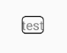

# shape

간단한 배경 구성이 가능한 위젯

## 지원 목록

- ShapeEditText : 텍스트상자
- ShapeTextView : 텍스트뷰
- ShapeImageView : 이미지뷰

## 구성 가능한 속성

- shape_cornerRadius : 모서리 각도
- shape_strokeWidth : 외선 두께
- shape_strokeColor : 외선 색상

## 사용방법

- 코드

```xml
<!--
    기존에 사용하던 방법
    drawable을 따로 작성하여 지정함
-->
<TextView
    android:layout_width="wrap_content"
    android:layout_height="wrap_content"
    android:background="@drawable/bg_some_text"
    android:text="test" />

<!-- ShapeTextView로 변경 -->
<com.nextstory.widget.ShapeTextView
    android:layout_width="wrap_content"
    android:layout_height="wrap_content"
    android:text="test"
    app:shape_cornerRadius="4dp"
    app:shape_strokeWidth="1dp"
    app:shape_strokeColor="@color/black" />
```

- 미리보기


